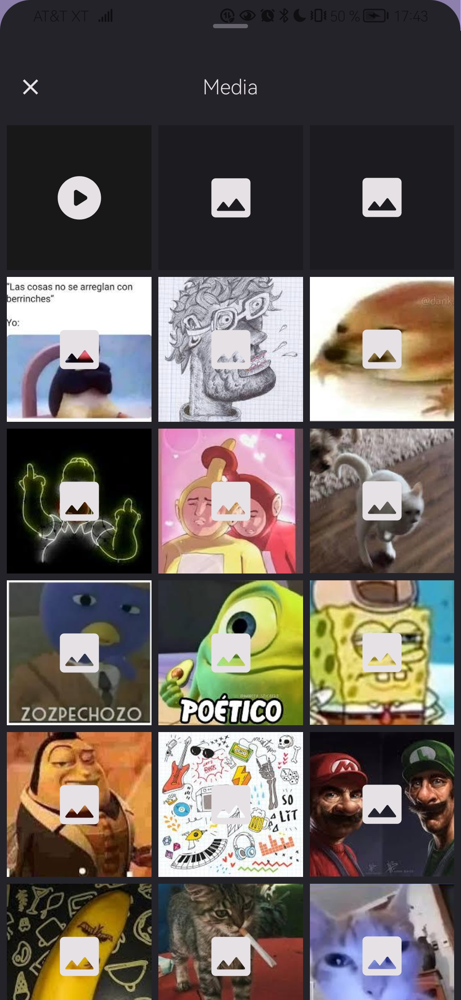
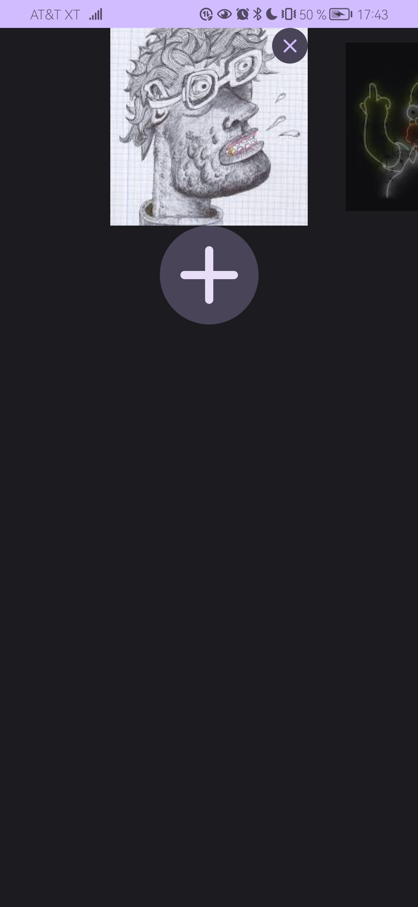

<div align="center">

# MediaPicker

### Fetch Video/Picture file from Android device, alternative to the default file manager

English
&nbsp;&nbsp;| &nbsp;&nbsp;
<a href="https://github.com/luisangeldd/MediaPicker/blob/main/README.md">Spanish</a>

<div align="left">

## 📱 Screenshots

<div align="center">
<div>




</div>
</div>
 
<br>

## 📱 Video

<div align="center">
 
https://github.com/luisangeldd/MediaPicker/assets/94653501/6e0f8c60-3114-4800-9f65-567bf58fecc8

https://github.com/luisangeldd/MediaPicker/assets/94653501/15910a1f-cecd-486a-9601-b2a7f31670cc

https://github.com/luisangeldd/MediaPicker/assets/94653501/5cf0ab8f-7919-4c4f-ada3-4a6308c1b9bf

</div>

<br>

## 📖 Features

- Get the video/image files from your Android device.

- One click to select any media on your device.

- Easy to use and friendly.

- Dependency injection with Koin or Dagger Hilt, simple and fast.

- [Material Design 3](https://m3.material.io/) style user interface.

- Only Compose and Kotlin.

- Inspired by Android's [photo picker](https://developer.android.com/training/data-storage/shared/photopicker?hl=es-419).

## 📖 Future Features

- Show device folders and their content "For some users it may be important to be able to access specific folders and search for specific content."

- Limit the number of items that can be selected "In some projects it may be necessary to limit the number of files that can be selected, either because they will be sent to a repository and space is important."

## ⬇️ How to

Step 1. Add the dependencies
<br>
```groovy
dependencies {
     ...
     implementation 'com.github.luisangeldd:MediaPicker:Tag'
}
```
```kotlin
dependencies {
     ...
     implementation("com.github.luisangeldd:MediaPicker:Tag")
}
```
If you were to use Koin in your project, add the following dependencies.
<br>
-Groovy

```groovy
dependencies {
     ...
     implementation 'io.insert-koin:koin-android:Tag'
     implementation 'io.insert-koin:koin-androidx-navigation:Tag'
     implementation 'io.insert-koin:koin-androidx-compose:Tag'
}
```
- Kotlin DSL

```kotlin
dependencies {
     ...
     implementation("io.insert-koin:koin-android:Tag")
     implementation("io.insert-koin:koin-androidx-navigation:Tag")
     implementation("io.insert-koin:koin-androidx-compose:Tag")
}
```
If you were to use Dagger Hilt in your project add the following dependencies.
<br>
-Groovy
```groovy
plugins {
     id 'com.google.dagger.hilt.android'
     id 'kotlin-kapt'
}
```
```groovy
dependencies {
     ...
     implementation 'androidx.hilt:hilt-navigation-compose:Tag'
     implementation 'com.google.dagger:hilt-android:Tag'
     kapt 'com.google.dagger:hilt-compiler:Tag'
}
```
- Kotlin DSL
```kotlin
plugins {
     ...
     id("com.google.dagger.hilt.android")
     id("kotlin-kapt")
}
```
```kotlin
dependencies {
     ...
     implementation("androidx.hilt:hilt-navigation-compose:Tag")
     implementation("com.google.dagger:hilt-android:Tag")
     kapt("com.google.dagger:hilt-compiler:Tag")
}
```
Step 2. Create a application class to inject the modules
- If you were to use Koin, use the following structure
```kotlin
class App: Application() {
    override fun onCreate() {
        super.onCreate()
        GlobalContext.startKoin {
            androidLogger()
            androidContext(this@App)
            modules(MediaPickerModuleKoin)
        }
    }
}
```
- If you were to use Dagger Hilt use the following structure
```kotlin
@HiltAndroidApp
class App: Application() {
    override fun onCreate() {
        super.onCreate()
        
    }
}
```
Step 3. Configure your manifest file
```kotlin
<?xml version="1.0" encoding="utf-8"?>
<manifest xmlns:android="http://schemas.android.com/apk/res/android"
    xmlns:tools="http://schemas.android.com/tools">
    <!-- Required only if your app needs to access images or photos
    that other apps created. -->
    <uses-permission android:name="android.permission.READ_MEDIA_IMAGES" />

    <!-- Required only if your app needs to access videos
         that other apps created. -->
    <uses-permission android:name="android.permission.READ_MEDIA_VIDEO" />

    <uses-permission android:name="android.permission.READ_EXTERNAL_STORAGE"
        android:maxSdkVersion="32" />

    <uses-permission android:name="android.permission.WRITE_EXTERNAL_STORAGE"
        android:maxSdkVersion="32" />
    <application
        android:name=".App"
        ...
    </application>
</manifest>
```
Step 4. Use in your application
<br>
- If you were to use Koin, use the following structure
```kotlin
class MainActivity : ComponentActivity() {
     override fun onCreate(savedInstanceState: Bundle?) {
         super.onCreate(savedInstanceState)
         setContent {
             AppNameTheme {
                 MediaPicker(
                     injectionByHilt = false,
                     getMedia = {}
                 )
             }
         }
     }
}
```
- If you were to use Dagger Hilt use the following structure
```kotlin
@AndroidEntryPoint
class MainActivity : ComponentActivity() {
     override fun onCreate(savedInstanceState: Bundle?) {
         super.onCreate(savedInstanceState)
         setContent {
             AppNameTheme {
                 MediaPicker(
                     injectionByHilt = true,
                     getMedia = {}
                 )
             }
         }
     }
}
```
## 🧱 Credits
- [kotlin](https://kotlinlang.org/)
- [MediaStore](https://developer.android.com/reference/android/provider/MediaStore)
- [Google Fonts:Icons](https://fonts.google.com/icons)

## License

    Copyright 2023 luisangeldd
 
    Licensed under the Apache License, Version 2.0 (the "License");
    you may not use this file except in compliance with the License.
    You may obtain a copy of the License at
 
        http://www.apache.org/licenses/LICENSE-2.0
 
    Unless required by applicable law or agreed to in writing, software
    distributed under the License is distributed on an "AS IS" BASIS,
    WITHOUT WARRANTIES OR CONDITIONS OF ANY KIND, either express or implied.
    See the License for the specific language governing permissions and
    limitations under the License.
