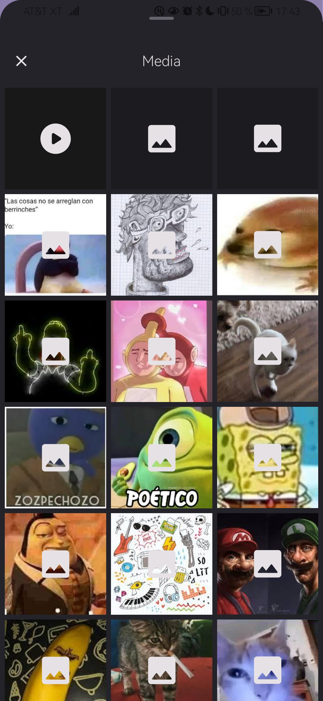
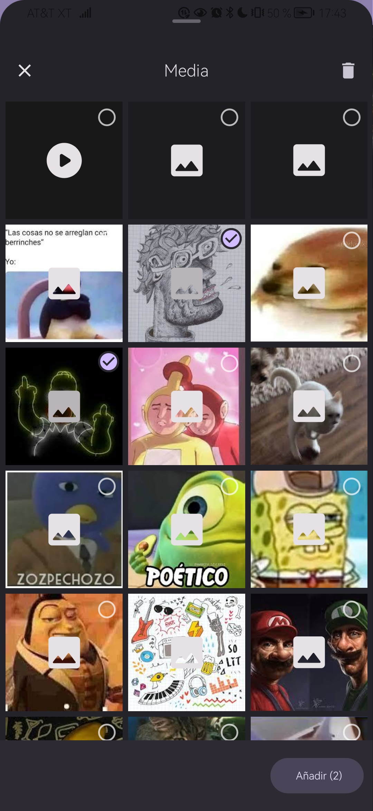
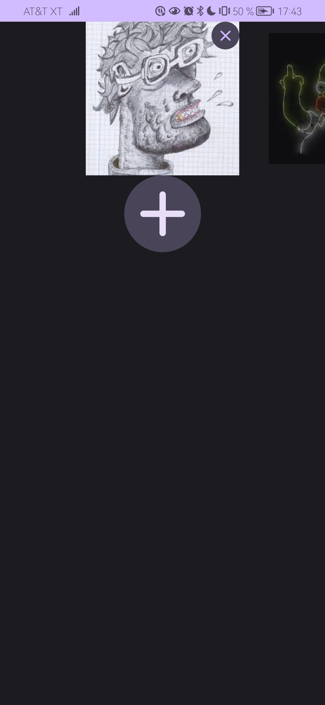

<div align="center">

# MediaPicker

### Video/Picture Fetch from Android device, alternative to the default file manager

English
&nbsp;&nbsp;| &nbsp;&nbsp;
<a href="https://github.com/luisangeldd/MediaPicker/blob/main/README-es.md">Spanish</a>

<div align="left">

## 📱 Screenshots

<div align="center">
<div>




</div>
</div>
 
<br>

## 📱 Video

<div align="center">
<div>

</div>
</div>

<br>

## 📖 Features

- Fetch videos and pictures/images files from android device.

- One click to select any media, from your device.

- Easy to use and user-friendly.

- Inject dependency whit Koin, simple and fast.

- [Material Design 3](https://m3.material.io/) style UI.

## ⬇️ How to

Step 1. Add the dependency

- Groovy

```groovy
dependencies {
    ...
    implementation 'com.github.luisangeldd:MediaPicker:Tag'
    implementation 'io.insert-koin:koin-android:Tag'
    implementation 'io.insert-koin:koin-androidx-navigation:Tag'
    implementation 'io.insert-koin:koin-androidx-compose:Tag'
}
```
- Kotlin DSL

```kotlin
dependencies {
    ...
    implementation("com.github.luisangeldd:MediaPicker:Tag")
    implementation("io.insert-koin:koin-android:Tag")
    implementation("io.insert-koin:koin-androidx-navigation:Tag")
    implementation("io.insert-koin:koin-androidx-compose:Tag")
}
```
Step 2. Create a application class to inject the modules
```kotlin
class App: Application() {
    override fun onCreate() {
        super.onCreate()
        GlobalContext.startKoin {
            androidLogger()
            androidContext(this@App)
            modules(appModule)
        }
    }
}
```
Step 3. Configure your manifest file
```kotlin
<?xml version="1.0" encoding="utf-8"?>
<manifest xmlns:android="http://schemas.android.com/apk/res/android"
    xmlns:tools="http://schemas.android.com/tools">
    <!-- Required only if your app needs to access images or photos
    that other apps created. -->
    <uses-permission android:name="android.permission.READ_MEDIA_IMAGES" />

    <!-- Required only if your app needs to access videos
         that other apps created. -->
    <uses-permission android:name="android.permission.READ_MEDIA_VIDEO" />

    <uses-permission android:name="android.permission.READ_EXTERNAL_STORAGE"
        android:maxSdkVersion="32" />

    <uses-permission android:name="android.permission.WRITE_EXTERNAL_STORAGE"
        android:maxSdkVersion="32" />
    <application
        android:name=".App"
        android:requestLegacyExternalStorage="true"
        android:requestRawExternalStorageAccess="true"
        ...
        <provider
                android:name="androidx.core.content.FileProvider"
                android:authorities="${applicationId}.provider"
                android:exported="false"
                android:grantUriPermissions="true">
                <meta-data
                    android:name="android.support.FILE_PROVIDER_PATHS"
                    android:resource="@xml/provider_paths" />
        </provider>
    </application>
</manifest>
```
Step 4. Create a provider_paths.xml file 
To the file provider_paths.xml that locate in resource/xml of your app and contain the next
```kotlin
<?xml version="1.0" encoding="utf-8"?>
<paths xmlns:android="http://schemas.android.com/apk/res/android">
    <root-path name="root" path="." />
    <external-path
        name="external"
        path="." />
    <external-files-path
        name="external_files"
        path="/" />
    <cache-path
        name="cache"
        path="." />
    <external-cache-path
        name="external_cache"
        path="." />
    <files-path
        name="files"
        path="." />
</paths>
```
Step 5. Use
```kotlin
class MainActivity : ComponentActivity() {
    override fun onCreate(savedInstanceState: Bundle?) {
        super.onCreate(savedInstanceState)
        setContent {
            AppNameTheme {
                MediaPicker(
                    getMedia = {}
                )
            }
        }
    }
}

```
